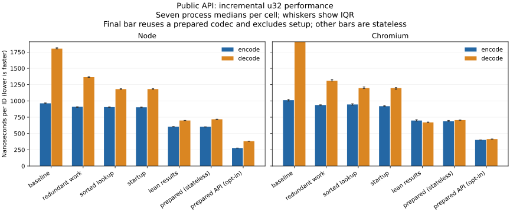

# Rust and JavaScript codec performance

Repeated calls using the new prepared codec reduce Node u32 encoding from
963 to 276 ns and decoding from 1,803 to 381 ns (3.5× and 4.7×). Chromium improves
from 1,011/2,650 ns to 401/414 ns (2.5× and 6.4×). These prepared timings exclude
one-time shape setup. The existing stateless API also improves, to 603/718 ns in
Node and 687/705 ns in Chromium. Native English-list decoding improves 7.6×.

The loader change reduces Node initialization from 17.2 to 1.48 ms in its isolated
stage, while retaining an asynchronous public API. The final prepared artifact
initializes in 1.58 ms (4.62 ms including import and its first operation). The compiler experiments did not
justify a different default. Word order, phrase bytes, accepted ranges, exact
integers and typed errors remain covered by tests.



## Measurement method

The fresh [baseline](../benchmarks/results/performance/00-baseline.md) uses the
original qualified WASM artifact and unchanged native sources at `5b7b1e6`.
The [raw observations](../benchmarks/results/performance/00-baseline.json) retain
source/artifact hashes, tool versions, CPU identity, load and all samples.

Each full comparison pins the process tree to CPU 19 on the same shared ARM host,
uses seven fresh processes per cell, warms for 100 ms, and measures three calibrated
batches targeting 100 ms. A process contributes its median batch time; the tables
report the median of the seven process medians. No rounds are discarded. The
4,096-ID fixture includes zero and u32::MAX, and every measured process checks
roundtrips and native/WASM phrase parity. Startup uses 30 fresh Node processes per
package, with a warm OS file cache and no Node compile cache.

Compare alternatives within a runtime. Native Rust, native JSON binding and public
WASM timings describe different layers; subtracting their times does not isolate
the WASM boundary. The existing comparator word counts and parsing semantics also
differ. These shared-host measurements are descriptive, not performance guarantees.

## Incremental results

Warm u32 encode/decode times are nanoseconds per ID. The existing public API uses
four animal words; the native English-list row uses three positional words, not a
BIP-39 wallet mnemonic. Detailed reports contain IQRs and all diagnostic cells.

| Stage | Native animal encode / decode | Node encode / decode | Chromium encode / decode | Native English-list decode |
|---|---:|---:|---:|---:|
| [00-baseline](../benchmarks/results/performance/00-baseline.md) | 83.4 / 394.0 | 962.9 / 1,802.5 | 1,010.9 / 2,650.5 | 1,612.8 |
| [01-redundant-work](../benchmarks/results/performance/01-redundant-work.md) | 84.7 / 392.3 | 909.5 / 1,364.5 | 936.9 / 1,310.7 | 1,613.4 |
| [02-sorted-lookup](../benchmarks/results/performance/02-sorted-lookup.md) | 82.9 / 252.4 | 904.8 / 1,180.9 | 945.3 / 1,197.8 | 213.2 |
| [03-startup](../benchmarks/results/performance/03-startup.md) | 82.5 / 252.3 | 902.1 / 1,181.4 | 918.6 / 1,198.6 | 213.3 |
| [05-lean-results](../benchmarks/results/performance/05-lean-results.md) | 83.5 / 251.7 | 603.4 / 699.1 | 698.5 / 669.9 | 213.3 |
| [06-prepared](../benchmarks/results/performance/06-prepared.md) | 82.5 / 252.0 | 602.8 / 718.0 | 686.6 / 705.3 | 212.5 |

### Repeated calls and remaining comparator gaps

These rows all come from the final prepared-codec artifact. Times are ns per ID
(or per name/setup for those rows), with process-median IQRs. Setup creates and
disposes a two-word codec; other prepared rows reuse a codec created before timing.

| Operation | Node median [IQR] | Chromium median [IQR] |
|---|---:|---:|
| Prepared u32 encode | 276.2 [274.5–277.4] | 400.9 [399.0–402.1] |
| Prepared u32 decode | 380.8 [380.5–382.9] | 413.5 [412.8–414.7] |
| Prepared pair setup + dispose | 405.7 [404.1–407.4] | 305.9 [305.5–307.6] |
| Prepared name + Math.random | 238.2 [237.1–239.3] | 851.4 [847.6–854.1] |
| unique-names-generator, shared lists | 163.4 [162.5–164.1] | 102.0 [101.9–102.1] |
| niceware u32 encode | 105.1 [104.8–105.6] | 123.3 [123.1–123.6] |
| niceware u32 decode | 525.7 [525.4–528.0] | 527.6 [525.3–528.1] |

Setup uses a two-word shape while the prepared u32 rows use four words; these
measurements do not establish a break-even call count for one shape.

The optimized package is not uniformly faster than the alternatives. Niceware
encodes u32 faster with two words from a larger dictionary; prepared nwords decodes
faster here with four animal words. UNG remains faster for random names, especially
in Chromium. Those differences include grammar, integer conversion, RNG adapter
and validation costs; they do not isolate a WASM crossing.

For repeated use:

```js
import { loadNwords } from '@y4le/nwords/node';
const words = await loadNwords();
const codec = words.prepare({ lists: Array(4).fill('animal'), range: 1n << 32n });
try {
  const phrase = codec.encodeId(42n);
  codec.decodePhrase(phrase); // 42n
} finally {
  codec.dispose();
}
```

## Change log and review

The initial performance triage was challenged by Opus through Parley in the original
checkout. A separate planning consultation checked the reusable-codec and ABI design against the original
package's ownership and validation contracts (`req_consult_0106d921ffcab5ee`).
Every substantive implementation diff receives Opus review; mechanical result
records follow measurements from committed source.

### 01-redundant-work: Avoid redundant binding work

Implementation source: `a5c76043a6f23a844a405ae968730102a877f360`. Opus review: `req_review_diff_f9c27f1dbcf28b0d`.

The Rust binding constructs the codec once per call. Short phrases skip UTF-8 allocation using a proven length bound; longer phrases retain the byte check and its error precedence. Packed Unicode and range tests pass. Word lookup and the JSON success protocol are unchanged in this stage.

Detailed [measurements](../benchmarks/results/performance/01-redundant-work.md) and
[raw observations](../benchmarks/results/performance/01-redundant-work.json) include all rounds.

### 02-sorted-lookup: Binary-search frozen sorted lists

Implementation source: `a8bf2a23e7067b6b065b33729db3e53d1253bb61`. Opus review: `req_review_diff_f9c27f1dbcf28b0d`.

Binary search replaces linear lookup for the measured adjective, animal, color and English BIP-39 paths. Every frozen index is checked, including strict sortedness and misses. Other named lists, the legacy AdjectiveAnimal adapter and Japanese remain unchanged. This stage also records lookup metadata so report prose remains accurate without changing the timing loops.

Detailed [measurements](../benchmarks/results/performance/02-sorted-lookup.md) and
[raw observations](../benchmarks/results/performance/02-sorted-lookup.json) include all rounds.

### 03-startup: Avoid lazy Node web globals during initialization

Implementation source: `2b18dfcda3fece6aa0bbc1ad830cd034c93e4708`. Opus review: `req_review_diff_1924821ffec30449`.

The public loader remains asynchronous, compiling bytes before synchronously instantiating the compiled module. This avoids generic Request/Response checks in generated glue. Opus verified that the new Node guard fails with the original loader; retry, concurrency and source identity remain covered. Thirty separate instrumented probes report actual loader phases; normal uninstrumented cold results are authoritative.

Detailed [measurements](../benchmarks/results/performance/03-startup.md) and
[raw observations](../benchmarks/results/performance/03-startup.json) include all rounds.

The separate [before-change control](../benchmarks/results/performance/startup-before-probes.json)
uses 30 fresh processes per mode on CPU 19 with the stage-02 artifact. Normal
instrumented load is 17.905 ms; prewarming Request/Response costs 16.916 ms and
leaves 1.543 ms for load. These overlapping instrumented medians establish the
source of the cost; they are not subtracted from the ordinary cold measurements.

### 04-build-profiles: Measure compiler and optimizer configurations

Implementation source: `adabff5`. Opus reviewed the build tooling in
`req_review_diff_ef513851eaf215b3` and the comparison runner in
`req_consult_e674b4e5a61bc0c0`.

Five qualified artifacts were compared at one clean source revision with seven
fresh-process rounds per warm cell and 30 cold observations per configuration.
Thin/fat LTO did not establish a throughput improvement; size optimization was
larger and slower. Binaryen reduced WASM bytes about 10% at a throughput cost.
The default stays unchanged. See the [configuration comparison](../benchmarks/results/performance/04-build-profiles.md),
including full raw observations, qualification evidence, reproduction prerequisites
and the targeted experiment's host-load limitation. These measurements precede
the lean/prepared changes; compiler interactions with those APIs are unmeasured.

### 05-lean-results: Return phrases and BigInts directly on success

Implementation source: `18ce12c249394359f87b096c961824cebc7308a8`. Opus review: `req_review_diff_9992816c862a50df`.

Encode/decode success paths no longer serialize and parse JSON. Rust still validates canonical decimal inputs, including raw ABI calls; decode returns exact BigInt through wasm-bindgen. Errors, metadata and legacy diagnostic exports retain their envelopes. Raw and public vector checks include the full-u128 boundary.

Detailed [measurements](../benchmarks/results/performance/05-lean-results.md) and
[raw observations](../benchmarks/results/performance/05-lean-results.json) include all rounds.

### 06-prepared: Reuse a validated shape across calls

Implementation source: `cdb5633b0b275f91d70a4a32342ba5fcf4cf4919`. Opus review: `req_review_diff_9992816c862a50df`.

The optional prepare(shape) API snapshots a shape into a Rust-owned codec. Single-call validation and exact integers remain; the immutable facade supports explicit idempotent disposal and best-effort FinalizationRegistry cleanup. Five additional cells per JavaScript runtime measure prepared calls and constructor-plus-dispose cost. All 4096 four-word and pair outputs are checked before measurement; the stateless API remains available.

Detailed [measurements](../benchmarks/results/performance/06-prepared.md) and
[raw observations](../benchmarks/results/performance/06-prepared.json) include all rounds.

### 07-batch-experiment: Reject bounded array batching

A reviewed, qualified prototype batches arrays of 1, 16 or 256 IDs through
wasm-bindgen externrefs. Three fresh-process rounds per cell compare it with a
prepared loop that materializes and consumes the same outputs. At 256 IDs,
encoding is 34% slower in Node and 24% slower in Chromium; decoding is 22% and
20% slower. The public API therefore keeps the prepared single-call methods.
The [pilot report](../benchmarks/results/performance/07-batch-experiment.md) includes
the raw measurements, exact prototype patch, qualification evidence and reproduction
steps. Opus review: `req_review_diff_56d053ec890dfc67`.

## Scope left for separate experiments

Checked JsValue/BigInt input transport and a standalone pure-JavaScript codec were
conditional follow-ups, and are not implemented or benchmarked here. The decimal
input boundary still validates the complete u128 domain without wrapping. A second
codec implementation would duplicate parsing and frozen-list contracts. The current
results establish the useful prepared baseline and the remaining comparator gaps;
they do not claim that either unmeasured alternative would be slower.

## Validation

Workspace formatting, Clippy, all-feature tests, the no-default-feature alloc
build, frozen vector checksums and report aggregation checks all pass. Package qualification
installs the actual tarball and tests Node, CommonJS dynamic import, TypeScript
NodeNext/Bundler declarations, Chromium, loader recovery and the existing demo.
New tests accompany each changed contract or optimization invariant.

## Reporting provenance

The sorted-lookup stage adds a recorded lookup description and corrects report prose;
measurement loops and aggregation stay unchanged. Old raw results default to their
original linear-lookup description. The report script hash changes from
`47f5500794bfec241648d0e289e5340fe07184d7033f414966eb401ae85eb860` to `2b913c6e3922af2a8116c0f99ec7647ea5f8fe4866d30a08c3aa6dd485242170`.
Binary search is scoped to adjective, animal, color and English BIP-39; other named
lists and the older AdjectiveAnimal adapter are separate paths, and Japanese remains
linear because its frozen order is not byte-sorted.

The startup stage adds the instrumented-phase table and mode filtering; its report
hash is `ccb3cf6e1f338e931eeb901c1452b8bf1ede99f7e422116f87bbc4e17efed2e1`
through stage 06. Every raw stage records the exact report and harness hashes.

The [chart generator](../benchmarks/progress.py) reads the full stage JSON files
00, 01, 02, 03, 05 and 06, with final prepared rows from 06. It embeds the input
filenames and SHA-256 hashes in the SVG. Run `python3 benchmarks/progress.py` in
the separate plotting environment from `benchmarks/requirements-plot.txt`.

Final Opus review (`req_review_diff_ad0a1b36a1991483`) verified every comparator
table value and chart bar/whisker. Its generator, provenance, chart-label and
rounding findings are incorporated. Historical pilot runners retain their measured
bytes; their report/patch/summary sidecars supply reproduction and variability
evidence rather than silently changing a runner after measuring it.
